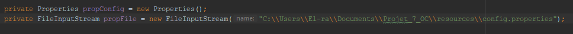
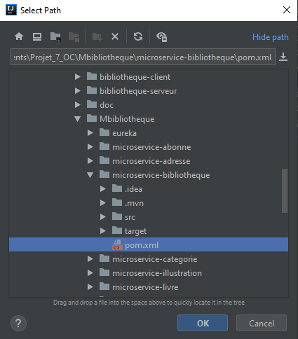
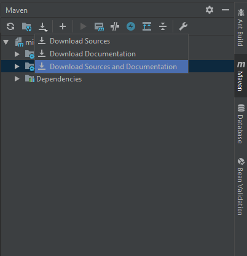
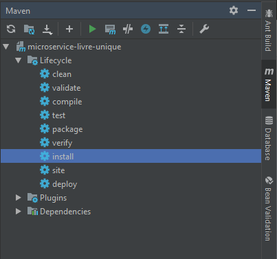

##  Mettre en place l'application
   
####  1) Créer la base de données :

   1. Faire un backup de la base de données avec le fichier SQL/backup.
    
   #   Mettre en place bibliotheque-seveur :
    
####   Modifier les variables dans le fichier webapp/META-INF/context.xml :

   1. Mettre l'url de la base de données.
   2. Changer l'username.
   3. Changer le password.
   
####   Modifier le path du fichier config.properties :
    
   1. Mettre en place le Path du fichier config.properties dans
    les classes fr.oc.projet.webapp.action.AjouterPretAction fr.oc.projet.webapp.action.ConsulterPretAction.
      
    Modifier la variable propFile.
    
   
    
    
    
####   Modifier les variables dans le fichier batch/src/data/conf/db-ticket.properties :
    
   1. Mettre l'url de la base de données.
   2. Changer l'username.
   3. Changer le password.

#   Mettre en place les microservices :

  #####Ouvrir le dossier MBibliotheque via son IDE
  
  ##  Mettre en place eureka avant les microservices, celui-ci s'implèmente de la même façon que les microservices.
    
   ####Action demandé pour chaque microservice : 
   
   Via Maven sélectionner le pom.xml du microservice via "Add Maven project" 
   
   
   
    
    Dans le Project Structure / Modules
        définir dans src/main le dossier java comme Source
        et le resources comme Resources
 
   
   
   
   Via Maven effectuer un download des sources pour vérifier que vous possèdez bien toutes les dépendances.
   
   
   
   Via Maven faire un install du microservice
   
   
   
   
   Pour faire fonctionner les microservices, vous devez lancer eureka dans un premier temps.
   
   
   # Mettre en place bibliotheque-client
   
   
   1. Effectuer les mêmes actions que pour un microservice.
   2. Chaques microservices doit-être lancé pour pouvoir lancer le client.
   
   ####   Modifier le path du fichier config.properties :
          
   1. Mettre en place le Path du fichier config.properties dans
          la classe
          fr.oc.projet.bibliothequeclient.action.GestionPretAction
            
          Modifier la variable propFile.
          
   
   
   
   
   
   # Informations supplémentaire
   
   Mot de passe du certificat de SSL : Yocorps17   
   Compte employé : el-rambo-poto@hotmail.fr   
   mot de passe : 123   
   
   
   # Changement apportés pour le release 2.0
   
  ### Système de réservation :
    - Mise en place des tests unitaires dans les microservices.
    - Ajout d'une table "Reservation" dans la base de données.
    - Ajout d'une valeur "sous_reserve" dans la table "livre_unique"
    - Ajout de l'envoie d'un mail quand un livre est restitué, un système de timer 
    et alors lancé pour supprimer la réservation sous deux jours et passer à la personne
    suivante dans la file. 
    - Un timer vérifie toutes les 2 heures si la réservation est toujours existante, si ce
    n'est psa le cas le système passe à la personne suivante.
    - Ajout d'une page pour consulter ses réservations et la position dans la file, ainsi
    que la possibilité de supprimer une de ses réservations;
    - Mise à jour de la pop-up "Consulter les livres disponibles" pour répondre 
    à la demande des réservations.
    - Mise en place de la gestion des réservations dans le cas ou un deuxième livre serait résitué
    pendant que la première personne dans la file a déjà un livre réservé.
    - Ajout d'une page de consultation des réservations d'un abonné qui peuvent êtres passés en prêt
    via l'action d'un employé.
    - L'employé peut lancer un prêt via une réservations si un livre a était assigné à la
    réservation.
    