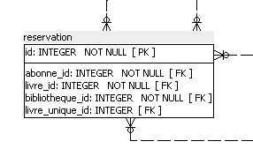

##  Ticket n°1
          
          
### Etape 1 : "Modifcation UML de la nouvelle fonctionnalité"

#### 1.
    - Modifications et ajouts de plusieurs use case sur la partie UML.
    
#### 2.
    - Mise en des fiches déscriptives et diagramme d'activité des nouveaux use case.
    
#### 3.
    - Ajout de plusieurs wireframes.
    
### Etape 2 : "Mise en place de la nouvelle table."

#### 1.
    - Ajout d'une table "reservation" dans la base de données.
    
   
   
       - abonne_id pour définir à qui est la réservation.
       - livre_id pour définir sur quel livre est la réservation.
       - bibliotheque_id pour définir dans quel bibliotheque la réservation est attendu.
       - livre_id pour définir un exemplaire une fois que celui-ci est disponible.
   
 #### 2.
 
    - Création du microservice de cette table.   
    - Mise en place des tests du microservice.
    - Création du controller qui récupère les données du nouveau microservice.
    
 #### 3.
 
    - Ajout d'une valeur "sous-reserve" dans la table livre_unique.
    celle-ci permet pendant la vérification toute les heures de savoir
    si la réservation a été retiré pour un prêt ou non.
    - Modification des objets LivreUnique pour mettre cette valeur en place.
    
 ### Etape 3 : "Modification de la partie web."
 
    - Modification de la barre de navigation pour les employés et abonnés.
    - Ajout d'une page jsp pour consulter les réservations d'un abonné.
    - Ajout d'une page jsp pour consulter ses réservations en cours.
    - Modification d'une page jsp pour ajouter un bouton reserver.
    - Ajout d'une page jsp pour créer une réservation.
   
 ### Etape 3 : "Intégration de la nouvelle fonctionnalité"

    - Ajout d'un bean de l'objet réservation.
    - Ajout d'une classe action pour la partie réservation.
    - Ajout d'une méthode dans la classe GestionLivreAction pour rajouter la possiblité
    de réserver pendant la consultation des détails d'un livre.
    - Création d'une classe qui gère l'envoie des mails une fois qu'un exemplaire a 
    été restitué à la bibliothèque.
    - Création d'une méthode dans la classe qui gère les mails, cette classe lance un timer de
    deux jours après l'envoie d'un mail de réservation. Si la personne ne récupére pas son livre 
    dans les deux jours la réservation est supprimée.
    - Création d'une méthode dans la classe qui gère les mails, cette méthode consulte toutes
    les heures si la réservation est toujours existante.