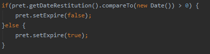
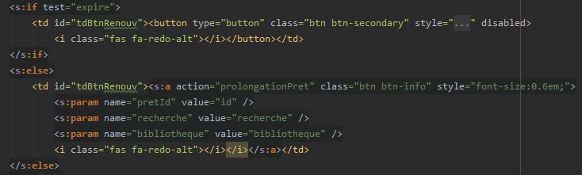

##  Ticket n°2
   
#### L'abonné ne peut pas prolonger son prêt après le delai dépassé. :
   
   - Ajout d'un boolean expire pour l'objet prêt.
   - Compare la date actuel et celle de restitution du prêt.
   - En fonction du résultat l'objet expire est vrai ou faux.
   
   
   
   - Si expire est true on affiche un bouton disable.
   - Si expire est false on affiche le bouton qui permet de prolonger le prêt en cours;

   
   
    