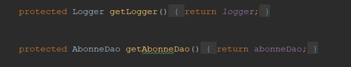
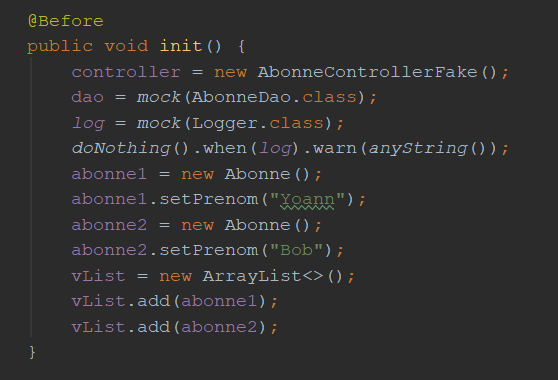
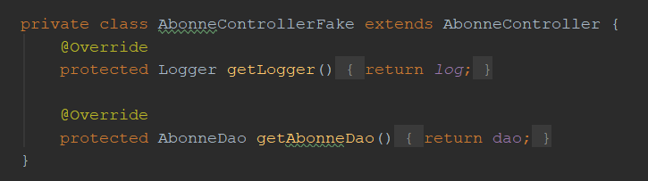
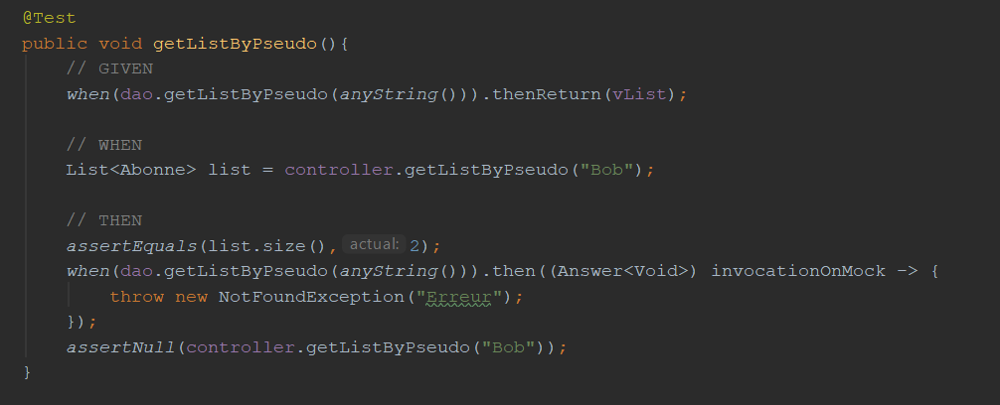
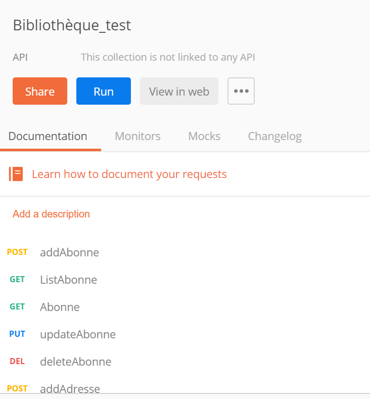
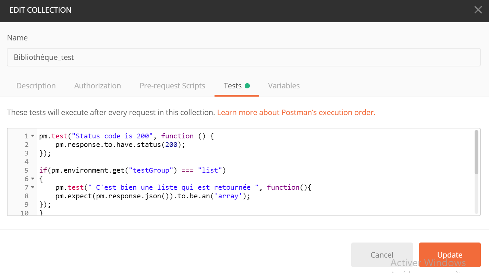
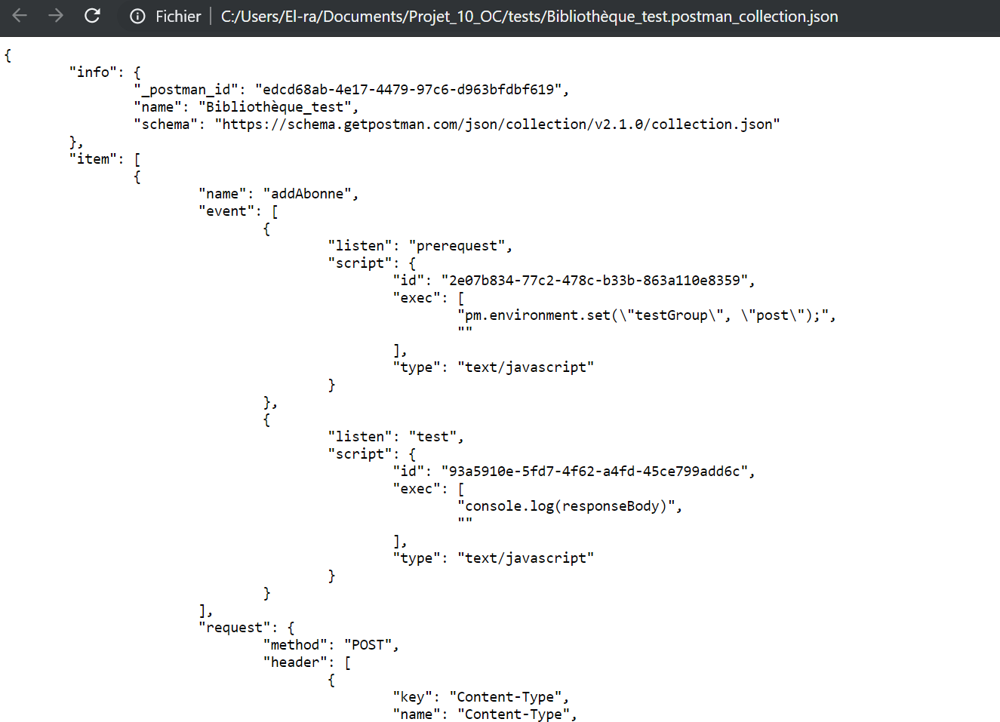
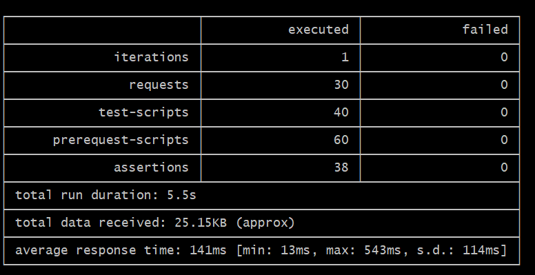
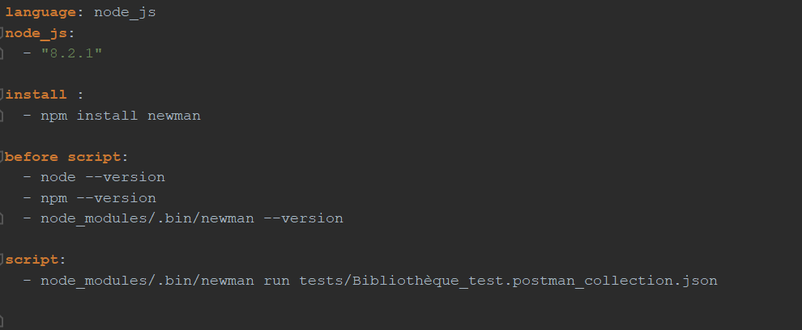

##  Ticket n°3
   
### Test unitaires :

   - Ajouts des méthodes getDao() et getLogger() pour pouvoir créer un fake.
   
   
   
   - Mise en place des mocks et stubs.
   
   
   
   - Création du fake dans la classe de test avec les mocks.
   
   
   
   - Test des méthodes et vérification des exceptions.
   
   
   
   
   
### Test d'intégrations : 
 
   - Création d'une collection sur Postman : https://www.getpostman.com/collections/089e535339b4f4936f3e
   
      
  
   - Intégration des tests pour les requetes de la collection.
   
      
   
   - Création du fichier de la collection en json pour pouvoir
   lancer le test via Travis CI.
   
      
   
   - Installation de node.js en local pour vérifier les test d'intégrations.
   - Installation de newman pour lancer les tests de la collection.
   
   - Vérification des tests via newman :
   
      
   
   - Ajout d'un fichier travis ci qui lance la collection de test postman avec newman.
   (Les microservices ne sont pas encore mis en ligne, travis ci ne peut donc
   pas récupérer les données avec les requetes.)
   
     
   
    